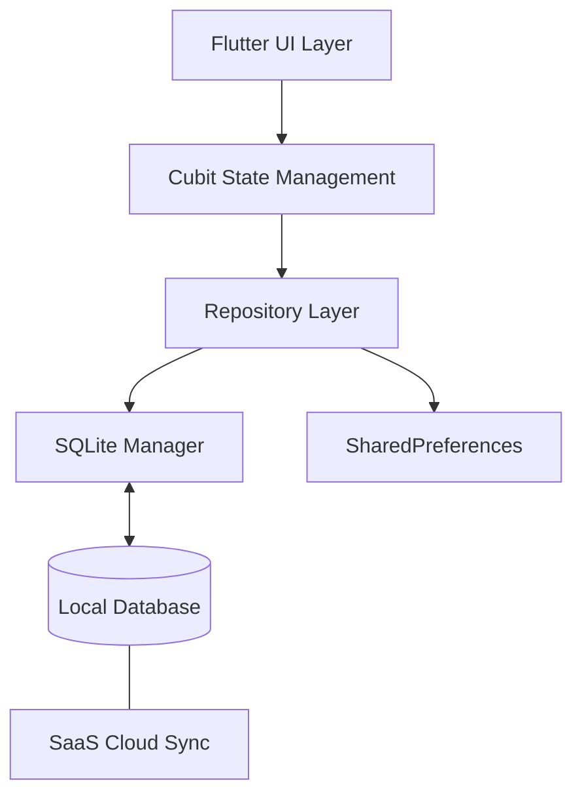

# <p align="center"></p>

<p align="center">
  
  
  
  
  
</p>

---

## 🍽️ About GrillPOS

**GrillPOS** is an enterprise-grade, modern SaaS-ready Point of Sale system specifically engineered for the high-pressure environment of grill restaurants and fast-paced food establishments. Leveraging the power of Flutter, it delivers a high-fidelity, responsive experience across Windows, Android, and iOS.

Designed with an **Offline-First** philosophy, GrillPOS ensures that your business operations never miss a beat, regardless of internet connectivity, while offering seamless cloud-sync capabilities for multi-tenant SaaS environments.

---

## 🚀 Core Features & Capabilities

### ⚡ Unified Point of Sale (POS)
*   **Intuitive Workflow**: Optimized for speed with large touch-friendly food cards and micro-interactions.
*   **Intelligent Filtering**: Dynamic category selection with smooth horizontal scrolling and mouse/touch drag support.
*   **Flexible Quantities**: Built-in support for fractional units (e.g., kilograms, grams) and real-time cart subtotal updates.
*   **Order Customization**: Add specific notes per item (e.g., "extra sauce") directly from the POS interface.

### 📈 Business Intelligence & Monitoring
*   **Pinned Metrics**: Critical statistics (Revenue, Orders, Occupancy) are pinned at the top for constant awareness.
*   **Responsive Analytics**: 4-column desktop layout ensuring optimal information density on high-resolution displays.
*   **Interactive Visuals**: Rich data visualization using `fl_chart` to track sales trends and peak restaurant hours.
*   **Custom Date Range**: Premium modal-based filtering for precise reporting across any period.

### 🪑 Operations Management
*   **Table Grid**: Real-time monitoring of restaurant floor status (Available, Occupied, Reserved, Cleaning).
*   **User Roles**: Robust permission-based isolation between **Manager** (full reports/settings) and **Cashier** (sales operations).
*   **Inventory Control**: Categorize and manage menu items with localized names (Ar/En) and availability toggles.

### 🖨️ Professional Printing
*   **PDF Generation**: Dynamic generation of high-quality invoices and kitchen slips.
*   **Thermal Printing**: Seamless support for 80mm and 58mm thermal printers common in restaurant hardware.

---

## 🏗️ Technical Architecture

GrillPOS follows **Clean Architecture** and **SOLID** principles to ensure maintainability and scalability.

### Project Structure (Expanded)

```text
lib/
├── core/
│   ├── components/       # Atom/Molecule UI components (Stat Cards, Dialogs)
│   ├── constants/        # Design systemTokens (Colors, Spacing, Typography)
│   ├── data/            # Global services (SQLite, Shared Prefs, Persistence)
│   ├── di/              # Dependency Injection (GetIt)
│   ├── theme/           # Global dark/light theme definitions
│   └── utils/           # Extension methods and helper utilities
├── features/
│   ├── auth/            # Multi-user login & role permission checking
│   ├── dashboard/       # Pinned stats & recent activity feed
│   ├── pos/             # Core sales interface & cart logic
│   ├── reports/         # BI analytics, charts, and filtering logic
│   ├── orders/          # Historical order management & status tracking
│   ├── menu/            # Localized category & menu item administration
│   ├── tables/          # Table layout management & lifecycle
│   └── users/           # Employee management & role assignment
└── main.dart            # Application entry point & service initialization
```

### Data Persistence Diagram (Mermaid)



---

## 🎨 Design System

GrillPOS features a bespoke design system optimized for long-shift usage in professional environments.

*   **Primary Palette**: `Warm Orange (#FF6F3C)` and `Charcoal Dark (#121212)`.
*   **Aesthetics**: Glassmorphism effects, smooth gradients, and subtle micro-animations.
*   **Typography**: Using `Amiri` for professional Arabic rendering and `Inter/Outfit` for English UI elements.
*   **Responsive breakpoints**:
    *   **Desktop**: 4-column grid (Pinned stats).
    *   **Tablet**: 2-column grid.
    *   **Mobile**: Single column optimized for vertical scrolling.

---

## 🛠️ Performance & Scalability

*   **Offline-First Architecture**: Ensuring sub-100ms response times for all local operations.
*   **Multi-tenant Preparedness**: Database records are indexed by `restaurant_id` to support SaaS scaling.
*   **Memory Efficiency**: Active streams for real-time table and order updates without polling overhead.

---

## 🛠️ Setup & Installation

### Requirements
*   Flutter SDK ^3.6.1
*   Desktop C++ / Xcode tools installed
*   SQLite runtime libraries

### Getting Started

1. **Clone & Install**
   ```bash
   git clone https://github.com/Desha29/GrillPOS.git
   cd GrillPOS
   flutter pub get
   ```

2. **Run Application**
   ```bash
   flutter run -d windows # for windows desktop
   flutter run -d chrome  # for web preview
   ```

---

## 🗺️ Future Roadmap

- [ ] **Phase 8**: Direct integration with cloud-based SaaS management portal.
- [ ] **Phase 9**: AI-powered inventory prediction based on historical sales.
- [ ] **Phase 10**: Multi-language support expansion (Spanish, French, etc.).

---

## 📄 License & Credits

Distributed under the **MIT License**. Created by the GrillPOS Development Team.

<p align="right">(<a href="#top">back to top</a>)</p>
